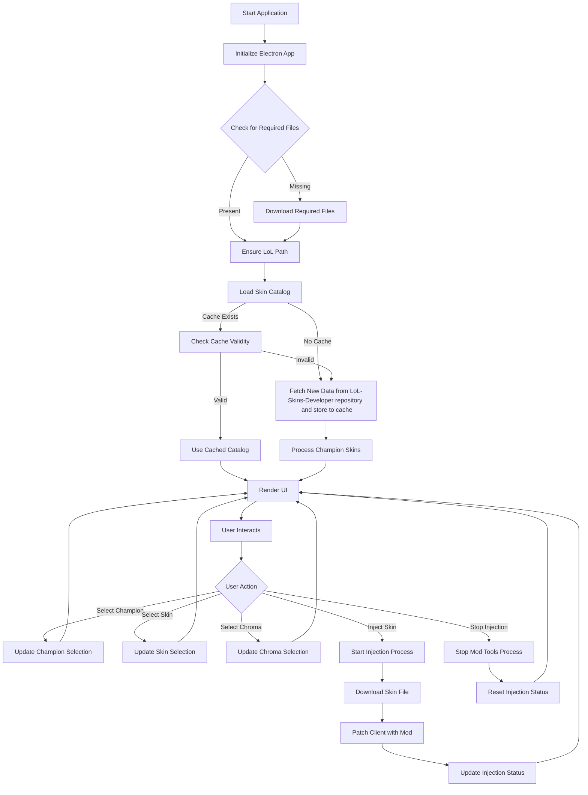

**Exalted** is a simple yet efficient tool designed to allow League of Legends players inject official skins into their game. It was made after the [brand-new skin tier](https://www.leagueoflegends.com/en-us/news/game-updates/dev-exalted-skins-the-mythic-shop-and-nexus-finishers/) announced by Riot Games!

Exalted works by loading a catalog of skins from our [lol-skins-developer](https://github.com/koobzaar/lol-skins-developer) repository, allowing you to browse through a wide variety of options for each champion, and then injecting your chosen skin into the game. It's important to note that these skins are only visible to you and do not offer any gameplay advantages.

The purpose of this project is not to undermine the custom skin scene within League of Legends. Instead, we aim to provide a solution for players who have been unable to afford skins since the introduction of Vanguard. Previously, these players relied on tools like LolSkin or R3nzSkin, which are no longer viable.

The creator of this repository believes that with the implementation of predatory practices in skin sales — exemplified by exclusive skins like the Faker skin, which cost as much as three months' wages in some regions — Riot has restricted access to certain content for a significant portion of its player base. 

> We hold that gaming culture should be inclusive and accessible, not just a privilege for those who can afford it.

https://github.com/user-attachments/assets/8d3ebb78-ff2e-414b-895a-8ffaf38ceb90

## Key Features

- **Browse and Select Skins**: A complete catalog of available skins fetched from lol-skins-developer.
- **Inject Custom Skins**: Quickly and easily apply the skin you choose directly to your client.
- **Support for Chromas**: Customize skins further with chroma options, if available.
- **Simple Interface**: Built using Electron, Exalted offers a straightforward and clean user experience for seamless skin injection.
- **Efficient Caching System**: Skin catalog data is cached for faster access after the first load.

### Step-by-Step Guide

1. **Download and extract**: Download from the releases, extract and run.
2. **Launch Exalted**: Start by launching the Exalted application on your computer.
3. **Ensure League of Legends Path**: The program will prompt you to confirm the installation path of League of Legends. It's probably on `C:\Riot Games\League of Legends\Game`
4. **Load Skin Catalog**: Exalted will either load the skins from a cached catalog or fetch the latest skin data from online resources.
5. **Browse Skins**: Use the user-friendly interface to browse through the skins available for each champion.
6. **Choose Skin/Chroma**: Select the skin and chroma (if available) that you wish to inject.
7. **Inject Skin**: Hit the "Play" button to apply the skin to your client.
8. **Select the default skin**: Make sure to select the default skin for your champion. The Exalted doesn't overlapse any skin.
9. **Launch the Game**: Once the injection is complete, wait for the League match to start.
    
### Installation

1. **Download the Latest Release**: Head over to our [GitHub releases page](https://github.com/koobzaar/Exalted/releases) to download the latest version of Exalted.
2. **Exctract the file**: Exctract using 7Zip or NanaZip.
3. **Run the Installer**: Follow the installation process as prompted by the installer.
4. **Launch and Start**: Open Exalted, and you’re ready to start browsing and injecting skins!
### How It Works

Exalted follows a clear and organized process to ensure that the skin injection is smooth and easy for users. Below is a flowchart that represents the key steps:

### FAQ

**Q: Can I get banned for using Exalted?**  
A: Using custom skins in League of Legends comes with some risk, as any modification to the game client can violate Riot Games' Terms of Service. That said, Exalted skins are purely visual and do not offer any gameplay advantages, but users should proceed with caution.

**Q: How do I update Exalted when League of Legends is updated?**  
A: Exalted will automatically download newer skins from our repository. If you want to get the newer version - keep looking at the releases folder.

### Contributing to Exalted

Contributions to Exalted are welcomed! Whether it’s by submitting new skins, improving the user interface, or fixing bugs, here’s how you can contribute:

1. **Fork the repository** on GitHub.
2. **Create a new branch** for your feature or bugfix.
3. **Submit a pull request** with a detailed description of your changes.

If you want to add new skins or fix some bug, checkout the database for Exalted: https://github.com/koobzaar/lol-skins-developer

### Legal Disclaimer

Exalted is not endorsed or affiliated with Riot Games in any way. Use of this program may violate Riot Games' Terms of Service, and users should proceed with care. All League of Legends logos, champions, and skins are owned by Riot Games.

### Donation

If you find Exalted useful and want to support its development, consider donating to help us keep the project alive:

- **Pix**: b2763e55-ac97-4963-83e9-d9827caed2de
- **Ko-Fi**: [Support on Ko-Fi](https://ko-fi.com/koobzaar)

Thank you for using Exalted! Enjoy exploring custom skins and making your gameplay experience more personal!
